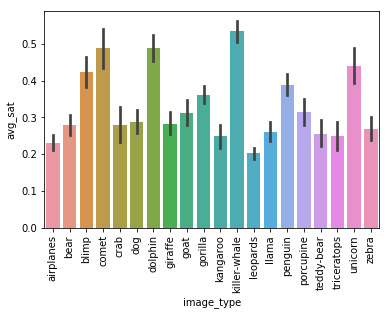
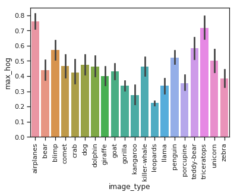

# MachineLearningGradProject

This repo hosts my graduate capstone project for Data Science 100 at UC Berkeley, partnered with Illan Halpern. We built an image classifier from scratch using tailored methods (exploratory data analysis, feature selection, training and regularizing models, etc), and with two neural nets: LeNet trained locally and ResNet18 trained with transfer learning.

# Task and Method

The task for this project was to develop an image classifier from scratch. We were given 1500 sample images, split into training and testing sets (80-20), such as the one below:

 

Using scikit-learn, we extracted features, such as the Histogram-of-Gradients (HOG):

We then analyzed how well these features distinguished among categories. For instance, the maximum of the HOG matrix and the average saturation both distinguished categories well: 

 

