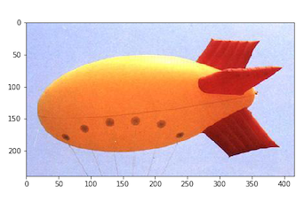

# MachineLearningGradProject

This repo hosts my graduate capstone project for Data Science 100 at UC Berkeley, partnered with Illan Halpern. We built an image classifier from scratch using tailored methods (exploratory data analysis, feature selection, training and regularizing models, etc), and with two neural nets: LeNet trained locally and ResNet18 trained with transfer learning.

 
