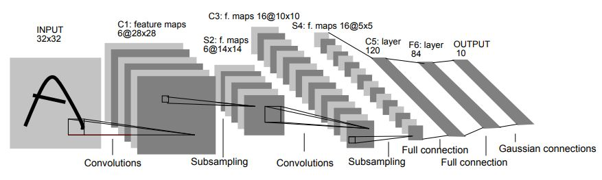

# MachineLearningGradProject

This repo hosts my graduate capstone project for Data Science 100 at UC Berkeley, partnered with Illan Halpern. We built an image classifier from scratch using tailored methods (exploratory data analysis, feature selection, training and regularizing models, etc), and with two neural nets: LeNet trained locally and ResNet18 trained with transfer learning.

# Task and Method

The task for this project was to develop an image classifier from scratch. We were given 1500 sample images, along with 700 validation and 700 test images, such as the one below:

 

Using scikit-learn, we extracted features, such as the Histogram-of-Gradients (HOG):

We then analyzed how well these features distinguished among categories. For instance, the maximum of the HOG matrix and the average saturation both distinguished categories well: 

 

while our fancier attempts to develop cross-correlations within color channels, such as the correlation function of the green and blue channels, did not:

# Model selection

Once we had a sufficiently large feature matrix, we fitted to a variety of models in scikit-learn. In particular, we fit LogisticRegression, K-NearestNeighbors, RandomForest and SVM classifiers, which each had their strengths -- except for LogisticRegression, which performed worse when evaluated on the test set. To prevent overfitting (introduce bias in the hopes of reducing variance), we included a regularization parameter into the models, and used GridSearchCV to find the optimal regularization. In both plots below, the dashed line is random guessing.

 

In all, this tailored approach reached roughly 40% prediction accuracy on the test set.

# Neural networks

Finally, we implemented two neural networks in order to improve this performance. We began by implementing LeNet, a relatively simple early architecture designed to work on the MNIST handwritten digits dataset:

 \[LeCun et al, 1998\]

However, due to the fact that it was designed to work with MNIST (28 x 28 pixel images), when we downsampled our much larger images, the network did not do a particularly good job at precition. Remarkably, though, even this rather poor network still performed on par with our hand-tailored approach, yielding about 33% prediction accuracy at its best. This network was trained from scratch on our laptops.

To do better, we used the ResNet-18 architecture within pytorch. We first attempted to train this from scratch, though quickly found that this was impractical without a GPU. So, we decided to try "transfer learning" -- taking a previously trained ResNet and re-training it on our particular set of images. This was quite successful, achieving a 94% success rate after relatively minimal training (about two hours on a laptop CPU). 

# This repo

This repo hosts all jupyter notebooks used in this project, as well as auxiliary files, in case you would like to re-implement anything for yourself or see what we have done in more detail. Enjoy!
